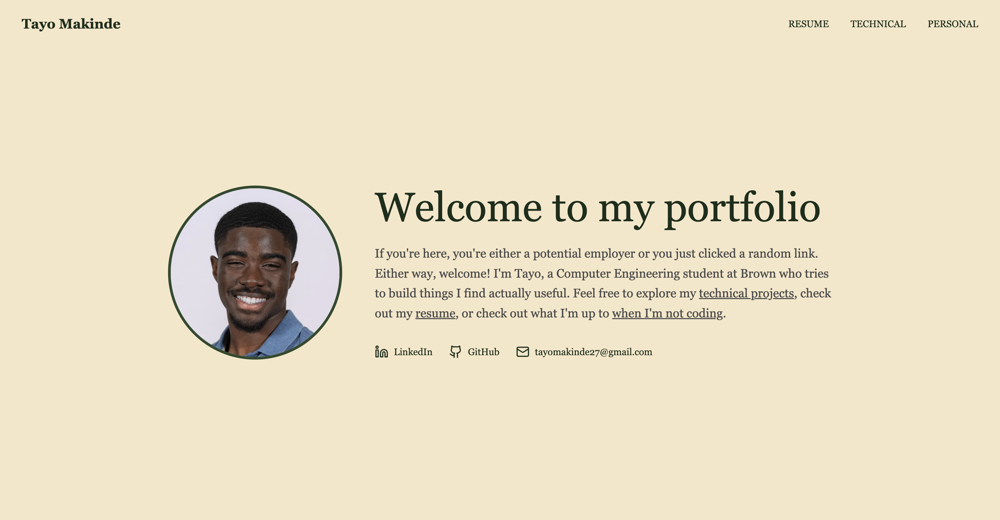

# Personal Website

A modern personal website built with Next.js, TypeScript, and TailwindCSS.



## Features

- **Home Page**: Hero section with profile information and social links
- **Resume Page**: Professional resume with downloadable PDF
- **Technical Page**: Showcase of technical projects including:
  - DeskCleaner
  - Basketball Shot Predictor
  - VR Data Analysis
- **Personal Page**: Personal interests including:
  - Currently Reading
  - Favorite Art Piece
  - Brown Run Club

## Tech Stack

- **Framework**: Next.js 15
- **Language**: TypeScript
- **Styling**: TailwindCSS
- **Icons**: Lucide React


## Project Structure

```
personalwebsitetayo/
├── app/
│   ├── page.tsx          # Home page
│   ├── resume/page.tsx    # Resume page
│   ├── technical/page.tsx # Technical projects page
│   └── personal/page.tsx  # Personal interests page
├── public/               # Static assets
├── components/           # Reusable components
└── tailwind.config.ts    # TailwindCSS configuration
```

## Deployment

This project was deployed using Vercel

## Author

Tayo Makinde

## License

MIT
